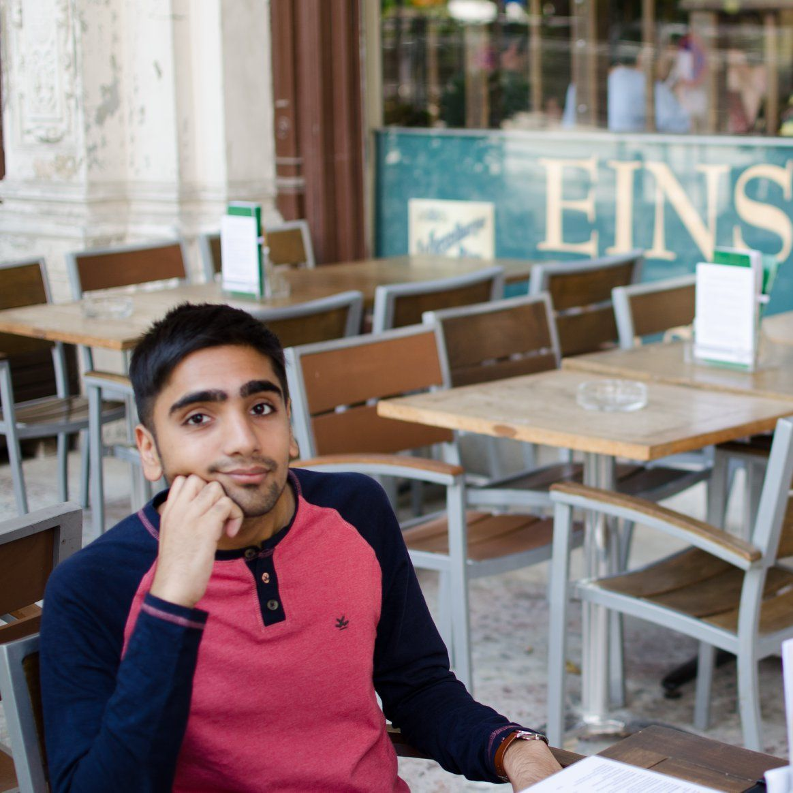

<head>
 <link rel="stylesheet" href="https://cdnjs.cloudflare.com/ajax/libs/font-awesome/4.7.0/css/font-awesome.min.css">
</head>

> Somewhere, something incredible is waiting to be known.

Carl Sagan

___

<a href="https://www.linkedin.com/in/akareddy" target="_blank" alt="linked in"><i class="fa fa-linkedin fa-2x"></i></a>  <a href="https://twitter.com/sidjai_" target="_blank"><i class="fa fa-twitter fa-2x"></i></a>

___

Research Interests
------

I am broadly interested in Theoretical Computer Science. While I am still exploring areas, I enjoy Algorithms which use insights from probability, combinatorics or graph theory. I also enjoy Complexity Theory and am enthusiastic about recent developments in Communication Complexity and Fine-Grained Complexity.

___

Projects
------
### Algorithms for Big Data
#### Prof Rajiv Raman | Independent Study
I am studying Streaming/Sketching algorithms from various sources and presenting to Prof Rajiv and some of my peers. I am also [compiling notes](https://drive.google.com/open?id=1WHWdqLdrVjDy0QJN4MpkjOJpQUcEhGRt) on what I present.

### Online Matching
#### Prof Syamantak Das | Independent Project

### Argh!
#### Algorithms Reading Group Hour

[Website](https://sites.google.com/iiitd.ac.in/argh)

### Guillotine Cuts & Pattern Avoidance in Permutations
#### Prof Rajiv Raman & Prof Samrith Ram | Bachelor's Thesis
In May 2018 I started working on Guillotine Cuts for Axis Parallel Rectangles. The general problem dates back to the paper [Cutting Glass](https://dl.acm.org/citation.cfm?id=336223) [Pach, Tardos] but the specific problem we're working on is presented directly in [On Guillotine Cutting Sequences](http://drops.dagstuhl.de/opus/volltexte/2015/5291/) [Abed, Chalermsook et al]. In particular, we want to know if one can always save Omega(n) rectangles and exactly what fraction is feasible. Such a lower bound would imply a polytime constant approximation for **MISR** (Maximum Independent Set on Rectangles), as explained in second linked paper. We found and explored an interesting link with Pattern Matching in permutations.

#### Project Resources

- [Project Notes](https://drive.google.com/file/d/1jIO42yqXNnvBV0but5ltBkpygqLOCK0j/view?usp=sharing)
- [(Draft of) Thesis](https://drive.google.com/open?id=1MuFOzVj7ZXyarMBzD414wb_ZIb7ey0na)
- [Talk - Pattern Matching in Permutations](https://drive.google.com/file/d/0B6YcTGvq8kkBTzNlRlJFbmEtY3BhUnZVNThNOTl4SklzRTZB/view?usp=sharing)
- [GitHub Repository](https://github.com/siddjai/GuillotineCuts)

___

> If you optimize everything, you will always be unhappy.

Donald Knuth

___

## Experience

### 2019
### Mathematics for Quantum Computation
#### IIAS Winter School | Hebrew University of Jerusalem
Accepted to the [4th CSE Winter School](http://ias.huji.ac.il/SchoolCSE4).

### Research Intern
#### Prof Bundit Laekhanukit | ITCS@SUFE
Visited Shanghai in the summer, hosted by [Prof Bundit](http://itcs.shufe.edu.cn/~blaekh/). 

### Mathematics for Data Science
#### IFCAM Summer School | IISc Bangalore
Selected for scholarship to attend the [summer school](http://math.iisc.ac.in/~ifcam/Summer_School2019.htm).

### 2018
### External reviewer for Journal of Computer and System Sciences (JCSS)
#### Prof Debajyoti Bera | IIIT Delhi

### Teaching Assistant | Discrete Structures
####  Prof Rajiv Raman | IIIT Delhi 
The course website can be found [here](https://sites.google.com/a/iiitd.ac.in/discrete-structures).
For students of IIITD, the Backpack course is [here](https://www.usebackpack.com/iiitd/m2018/mth210).

### Combinatorics & Graph Theory
####  Prof Samrith Ram | IIIT Delhi Internship
Selected to study various topics in Combinatorics and Graph Theory during the summer term.

### 2017
### Graph Theory & Algorithms
#### ACM Summer School | IIT Gandhinagar
I was a scholar selected to study state of the art material from renowned professors. The school had the objective of motivating research and promoting collaboration. 

___

Notable Courses
------
 - Randomised Algorithms (A-) 
 - Complexity Theory (A) ([Website](https://sites.google.com/a/iiitd.ac.in/cse621m18/))
 - Modern Algorithm Design (A) ([Website](https://sites.google.com/a/iiitd.ac.in/mad18/home))
 - Theory of Computation (A) ([Website](https://sites.google.com/a/iiitd.ac.in/cse322-w18/))
 - Discrete Structures (A)
 - Combinatorics (A)
 - Linear Optimisation (A)
 - Number Theory (A+) 
 - Abstract Algebra I (A)
 - Abstract Algebra II (A-) 
 - Intro to Dynamical Systems (A)
 - Competitive Programming 1 (A)
 - Linear Algebra (A-) 

 
IIIT-Delhi Grading Scheme
 
 Letter Grade | Grade Point | Comment
--- | --- | ---
A+ | 10 | Outstanding
A | 10 | 
A- | 9 |
